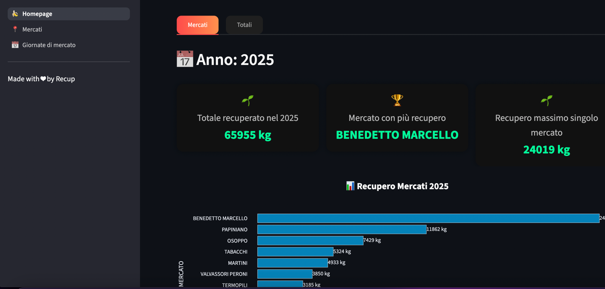
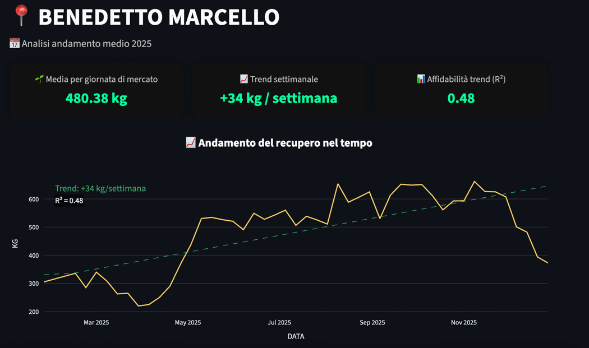
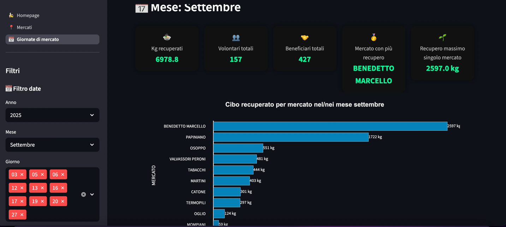
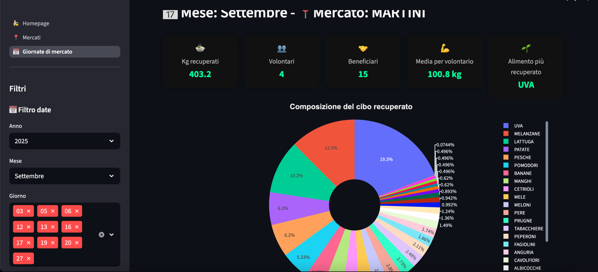

# Recup – Food Recovery Data Pipeline & Analytics Dashboard

End-to-end data pipeline and interactive dashboard to analyze surplus food recovered from local markets by the 
association **Recup**, a non-profit organization that redistributes unsold food to the community instead of letting it 
go to waste.
The project extracts raw data from Google Forms, cleans inconsistent free-text inputs (food items and volunteer names), 
builds a structured dataset, and powers a Streamlit dashboard to explore food recovery activity, volunteer participation
and redistribution impact.

## Dashboard Overview


## Project goals

- Transform messy real-world data into structured datasets
- Analyze food recovery and redistribution activity
- Visualize the impact of grassroots initiatives tackling food waste

## Project details

Recup volunteers collect unsold food from local markets and redistribute it freely to anyone who needs it.
During each recovery session, volunteers record the recovered food and its weight using a **Google Form**.
The form responses are stored in a **Google Sheet**, where the recovered food is entered as **free text**, for example:
```
Banane: 49.0, Cachi: 42.5, Pere: 25.9, Arance: 10.1, Mele: 3.5
```

Because the field is free text, entries can contain:
* different separators (`: , ;`)
* decimal formats (`25.9` or `25,9`)
* units (`kg`)
* inconsistent naming
* duplicated items in the same entry
* typos

This project implements a **Python ETL pipeline** that cleans and structures this data, and a **Streamlit dashboard** 
that allows exploration of food recovery metrics.

---

# Data pipeline architecture

```
Google Form
      ↓
Google Sheets
      ↓
ETL pipeline (Python)
      ↓
Structured dataset
      ↓
Interactive dashboard (Streamlit)
```

The pipeline converts unstructured text into a structured dataset usable for analysis.

Example output structure:

| date       | market             | food   | kg   |
| ---------- | ------------------ | ------ | ---- |
| 28/02/2026 | Benedetto Marcello | Pere   | 25.9 |
| 28/02/2026 | Benedetto Marcello | Arance | 10.1 |
| 28/02/2026 | Benedetto Marcello | Mele   | 3.5  |

---

# Key challenges solved

The project focuses on **cleaning messy real-world data**.

The ETL pipeline handles:
* parsing unstructured food descriptions
* cleaning inconsistent separators and formats
* converting different decimal conventions
* removing units like `kg`
* normalizing product names
* aggregating duplicated food items
* producing a structured dataset for analysis

---

# Repository structure

```
recup-food-recovery-analytics
│
├── etl/
│   ├── extract.py
│   ├── transform.py
│   ├── load.py
│   └── run_pipeline.py
│
├── src/
│   └── food_parser.py
│
├── dashboard/
│   └── app.py
│
├── examples/
│   └── sample_input.txt
│
├── requirements.txt
├── README.md
└── .gitignore
```

### ETL (`etl/`)

Handles data ingestion and transformation.

Steps:

**Extract**

* read Google Sheets export

**Transform**

* parse food descriptions
* normalize food names
* convert weights to numeric values
* aggregate duplicated items

**Load**

* generate a structured dataset used by the dashboard

---

### Parsing logic (`src/`)

The core of the transformation process. The parser converts messy text such as:
```
banane 49 kg; pere 25,9; pere 3
```
into structured data:

| food   | kg   |
| ------ | ---- |
| banane | 49   |
| pere   | 28.9 |

---

### Dashboard (`dashboard/`)

An interactive **Streamlit** dashboard allows exploration of food recovery data collected by the association Recup 
during market recovery activities.

The dashboard provides insights into the impact of food redistribution initiatives and helps monitor operational 
activity across markets.

Main features:
* Total recovered food over time
* Breakdown of recovered food by market
* Distribution by food category
* Most recovered food items
* Interactive filtering by date and market
* Number of volunteers involved in each recovery session
* Number of beneficiaries receiving redistributed food

The dashboard helps visualize the impact of food recovery activities and supports data-driven decisions for logistics 
and volunteering.

#### Volunteer data processing

Volunteer participation is recorded in the Google Form as a free-text field, where volunteers' names are entered 
manually during each recovery session.
Examples of raw inputs include:
```
Sofia, Stefania, Letizia, Marco, Donatello, Davide, Alberto, Roberta 
```
or
```
Andrea rossi  Giuli Verdi  Lorenza Neri Alessandra Marroni Cristina Gialli Laura arancioni
```
or
```
Luca Gialli, Pietro Verdi, Edoardo Rossi
```
Since the data is often inconsistent (different separators, missing commas, variable spacing), the Dashboard code 
includes a data cleaning step that:
* Detects individual names using pattern-based parsing
* Normalizes inconsistent separators (commas, spaces, punctuation)
* Removes duplicates
* Counts unique volunteers for each recovery session
This allows the dashboard to accurately track volunteer participation over time.

The dashboard uses **Plotly** for interactive visualizations.

## Dashboard Preview

### Dashboard: Time series of food recover in a single market



### Dashboard: Date filter



### Dashboard: Total food recovered in single market filtered by month and breakdown by item



---
# Technologies used:
* Python
* Pandas
* NumPy
* Plotly
* Streamlit
* Google Sheets API
---

---
The project demonstrates how data engineering and visualization can support grassroots initiatives tackling food waste 
and improving food redistribution.
---

# Running the project

Install dependencies:

```
pip install -r requirements.txt
```

Run the dashboard:

```
streamlit run dashboard/app.py
```

---

# Data privacy

The repository does **not include the real datasets used by Recup**.
Only the processing logic and example inputs are provided.

---

# About Recup

**Recup** is a non-profit organization that fights food waste by recovering unsold food from local markets and 
redistributing it freely to the community. The association is active in the cities of Milan and Rome. It carries out 
concrete actions to fight food waste, address the climate crisis, and promote active citizenship.

This project was developed to support data analysis of food recovery activities.

---

# Author

Personal data engineering and analytics project developed to support Recup's food recovery initiatives.

The project uses Google Sheets API with credentials managed via Streamlit Secrets.
Credentials are not included in the repository for security reasons.